# FamCal Architecture Diagrams

Interactive diagrams using Mermaid JS. View these on GitHub or any Mermaid-compatible viewer.

## Table of Contents

1. [System Overview](#system-overview)
2. [Application Layers](#application-layers)
3. [Database Schema](#database-schema)
4. [Component Hierarchy](#component-hierarchy)
5. [Data Flow](#data-flow)
6. [Photo Mode State Machine](#photo-mode-state-machine)
7. [API Request Flow](#api-request-flow)
8. [Deployment Architecture](#deployment-architecture)

---

## System Overview

High-level view of the FamCal system architecture.


---

## Application Layers

Detailed view of the Next.js application structure.


---

## Database Schema

Entity relationship diagram for all database models.

```mermaid
erDiagram
    FamilyMember ||--o{ ChoreAssignment : "assigned to"
    FamilyMember ||--o{ ChoreCompletion : "completes"
    FamilyMember ||--o{ PointTransaction : "earns/spends"
    FamilyMember ||--o{ RewardRedemption : "requests"
    FamilyMember ||--o{ RewardRedemption : "approves"
    FamilyMember ||--o{ HabitLog : "logs"

    Chore ||--o{ ChoreAssignment : "has"
    Chore ||--o{ ChoreCompletion : "tracked by"

    Reward ||--o{ RewardRedemption : "redeemed as"

    Habit ||--o{ HabitLog : "logged in"

    FamilyMember {
        string id PK
        string name
        string avatar
        string color
        string role
        string email
    }

    Chore {
        string id PK
        string title
        string description
        int points
        string recurrence
        string recurDays
        boolean isActive
    }

    ChoreAssignment {
        string id PK
        string choreId FK
        string assigneeId FK
        int rotationOrder
    }

    ChoreCompletion {
        string id PK
        string choreId FK
        string completedById FK
        datetime completedAt
        datetime scheduledFor
    }

    Habit {
        string id PK
        string name
        string icon
        int points
        string frequency
        boolean isActive
    }

    HabitLog {
        string id PK
        string habitId FK
        string familyMemberId FK
        datetime completedAt
        string completedDate
    }

    Reward {
        string id PK
        string name
        string description
        int pointsCost
        string icon
        boolean isActive
        boolean isCashReward
        float cashValue
    }

    RewardRedemption {
        string id PK
        string rewardId FK
        string requestedById FK
        string approvedById FK
        int pointsSpent
        string status
        datetime approvedAt
    }

    PointTransaction {
        string id PK
        string familyMemberId FK
        int amount
        string type
        string description
        datetime createdAt
    }

    Task {
        string id PK
        string title
        boolean completed
        string priority
        datetime dueDate
    }

    ShoppingItem {
        string id PK
        string name
        int quantity
        string store
        boolean checked
    }

    ScheduleItem {
        string id PK
        string title
        string time
        string icon
        string days
    }

    Settings {
        string id PK
        string displayName
        int carouselInterval
        string carouselAnimation
        string headerMode
        string weatherCity
        float weatherLat
        float weatherLon
        boolean screensaverEnabled
        string screensaverPhotoPath
        int screensaverInterval
    }
```



---

## Component Hierarchy

React component tree for the dashboard.


---

## Data Flow

How data flows through the application.


---

## Photo Mode State Machine

State transitions for photo mode display logic.


---

## API Request Flow

Detailed flow for API requests with authentication context.


---

## Deployment Architecture

Infrastructure diagram for Raspberry Pi deployment.


---

## Animation System

Widget carousel animation flow.


---

## Weather Data Flow

Weather fetching and display pipeline.


---

## Points & Rewards Flow

Complete points lifecycle.


---

## Viewing These Diagrams

### On GitHub
GitHub automatically renders Mermaid diagrams in markdown files.

### Local Viewing
1. **VS Code**: Install "Markdown Preview Mermaid Support" extension
2. **Browser**: Use [Mermaid Live Editor](https://mermaid.live)
3. **CLI**: Use `mmdc` (Mermaid CLI) to export as PNG/SVG

### Export to Images
```bash
npm install -g @mermaid-js/mermaid-cli
mmdc -i ARCHITECTURE-DIAGRAMS.md -o diagrams/
```
